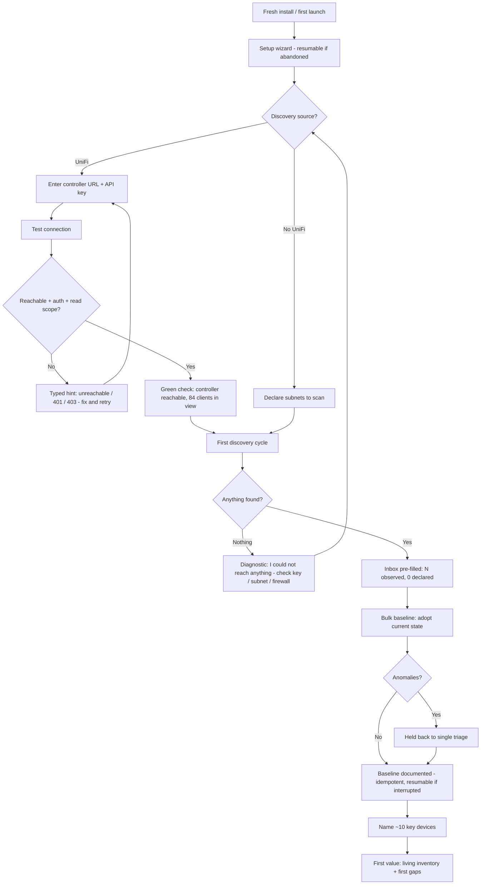
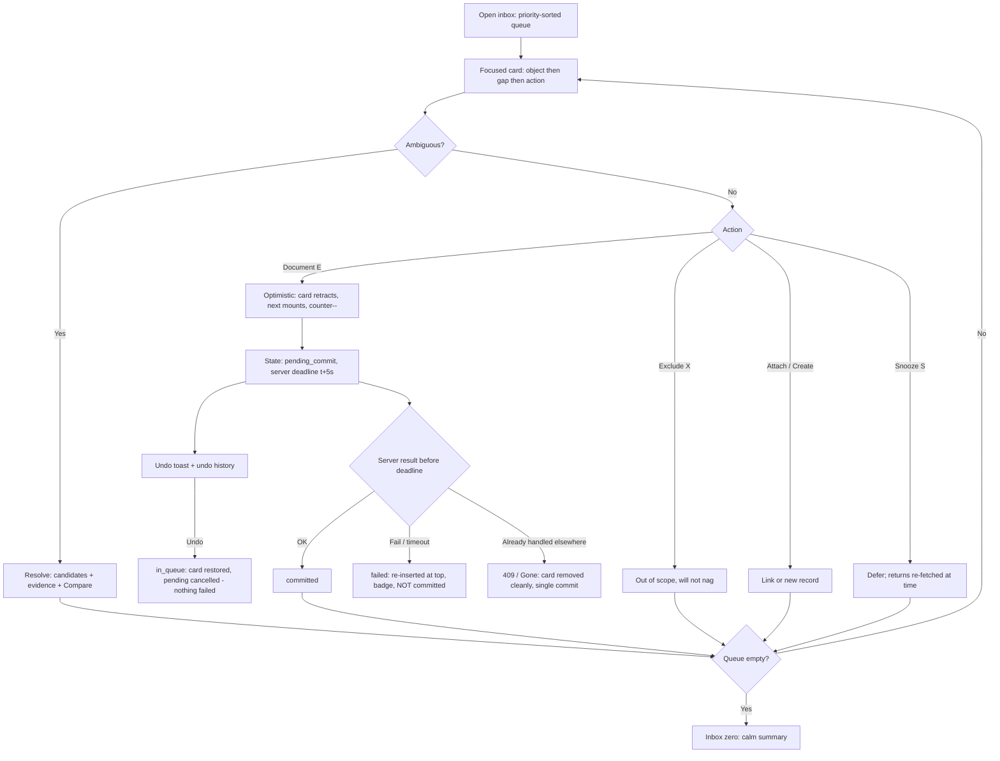
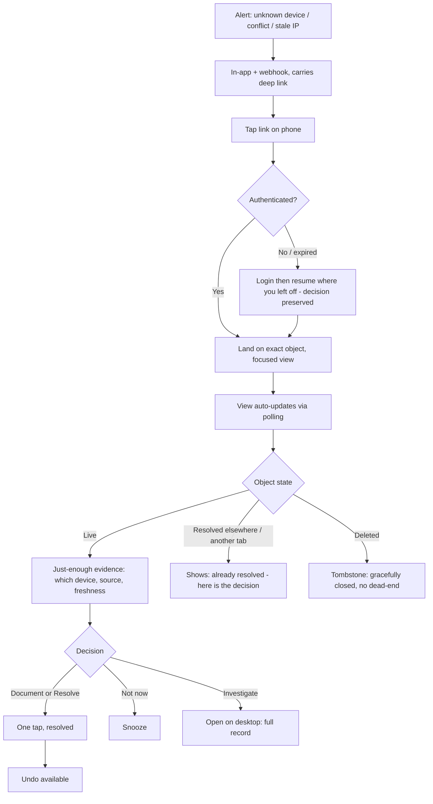
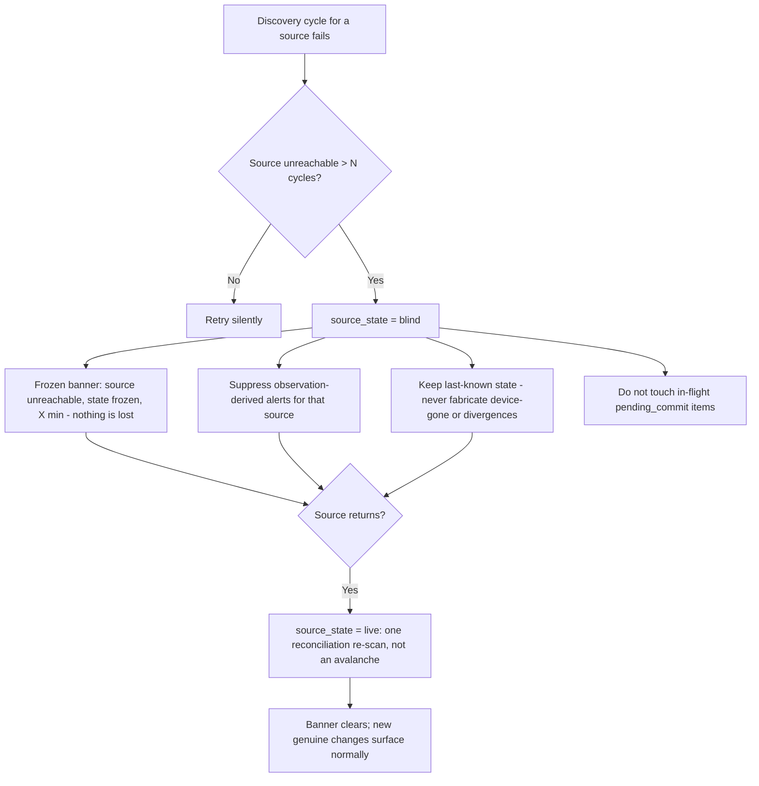

# UX Design Specification opencmdb

**Author:** Guy
**Date:** 2026-07-15

---

<!-- UX design content will be appended sequentially through collaborative workflow steps -->

## Executive Summary

### Project Vision

The 10-second job is **"What changed, and what do I document?"** — see where the network
lies, acknowledge in one tap. Everything else is context for that decision. The guiding
mental model is **two photos of the same network, superimposed**: one taken by the machine
(*observed* — what actually breathes on the wires), one drawn from memory by the operator
(*declared* — intent). The product is neither photo but the **offset between them**.
Critically, **neither side is "the truth"** — an observation can be stale or from a blind
source, a declaration can be outdated — so the UI gives each side visible **provenance and
freshness**, and never frames observed as fact and declared as error. The tone is dignity,
not judgment: no accusatory red, no error counters; the language of calm gardening
("3 things grew while you were away"), so a gap feels like a harvest, not a failing.
Server-rendered HTMX (bilingual EN/FR, responsive); simplicity is the product. This
specification is a **v1 hypothesis** — real usage (dogfooding, telemetry, community
feedback) will show what to improve, so the design favors modular, cheap-to-change patterns.

### Target Users

A single, unified operator persona — **"Marc"**: a technically confident operator of a
small-but-nontrivial network (advanced home-lab or an SMB without dedicated IT). Comfortable
with infrastructure, impatient with ceremony, unwilling to maintain a manual source of truth.
He lives across two contexts with distinct intents:
- **Mobile — triage fast:** a reactive moment (an 11 p.m. conflict alert) where he wants to
  decide from *just-enough* evidence and resolve in one tap.
- **Desktop — investigate & document:** deliberate work (Sunday documentation, IPAM, deep
  investigation).

### Surface Hierarchy

Not all surfaces are equal. The design must make this hierarchy visible.
- **Primary — the reconciliation loop:** the **triage inbox + documenting**. The
  10-second task lives here; from "see the gap" to "documented" is **≤ 1 tap**. This surface
  dominates; everything else supports it.
- **Supporting (daily return):** the **self-diagnostic dashboard led by "what changed since
  last visit"**, plus **source-health** status.
- **Task-specific (each justified by a journey, not a co-equal signature):** per-subnet **IP
  occupancy + free-IP lookup** (the "find a free IP" / conflict job), the **device record's
  "Hosted here" panel** (migration-prep: "before I power this down, what is running on it?" — one
  containment hop, FR39; _D57-scope: the traversal-based blast radius is Growth_), and **deep-linked focused
  object views** (the mobile conflict).

### Key Design Challenges

- **Cold-start onboarding (day zero):** the inbox opens as N observed / 0 declared — the gap
  is *everything*. Documenting must feel like a reassuring **mass gesture** ("this is
  your network — bulk-document the expected"), not N separate decisions.
- **"Observed vs declared" is a semantic challenge, not a visual one:** the risk is a user
  reading observed = real, declared = wrong, and "fixing the network" instead of documenting
  intent. The **legend and language** are the real deliverable — never a naked gap; anchor
  each in an action-phrase ("Discovered on eth0 — expected? Document.").
- **Honest trust & uncertainty:** provenance + freshness on both sides; source-health ("a
  source is blind"); ambiguity shown as candidates + evidence; the **document action previews
  what will change *before* confirming**, not after.
- **Dignity, never moralizing:** no accusatory styling, no shame counters; calm-gardening tone.
- **Mobile-first focused resolution:** land precisely on the object, decide from just-enough
  evidence, resolve in one tap; deep work stays on desktop.
- **Density without overwhelm:** dashboard-first, progressive drill-down.

### Design Opportunities

- The signature **reconciliation "gap" view** — the two superimposed photos, each side sourced
  and timestamped — the visual heart of the product.
- A calm **"what changed since last visit"** surface that respects absence instead of
  guilt-tripping.
- **Source-tagged evidence chips** (provenance + freshness) as a reusable trust primitive
  across the whole UI.
- **Bulk documenting** as both a first-run relief gesture and a routine one.
- Task-specific visuals that earn their place: **occupancy** (find-free-IP / conflict) and
  **"Hosted here"** on the device record (migration-prep) — supporting, not signature. _(D57-scope: the
  traversal-based impact view is Growth. **The word "Impact" is refused on a one-hop screen** — a view named
  Impact that concludes "nothing else is affected" is FR7's `satisfaction` trap with a nav entry.)_

## Core User Experience

### Defining Experience

The core loop is **observe → surface the gap → decide → the gap closes**. The single defining
action is **documenting** — promoting an observed reality into declared documentation.
The core screen is the **triage inbox**; the core gesture is one confident tap that says "yes,
this is my network." Get this loop right and the product works; get it wrong and opencmdb is
just another scanner.

### Triage Card: Visual Hierarchy (the 3-second test)

On each discovery card the eye must catch three things, in order: **(1) which object**
("New: Raspberry Pi · 192.0.2.42"), **(2) the nature of the gap** (observed, not yet
declared), **(3) the document action** (FR UI: « Merger »). Everything else is secondary.
- **Document is the only high-contrast element** — a single chromatic accent per card. If every
  chip shouts, none is heard.
- **The preview *is* the card:** the observed-vs-declared comparison (e.g. "Observed VLAN 20 /
  Declared VLAN 10") is pre-rendered inline, so the tap confirms what the user already reads —
  **never a modal that pops after the tap** (that would be two taps in disguise).
- **Provenance + freshness are a discreet meta-line** (tone-on-tone, below the cognitive fold);
  one signature evidence chip is shown, the rest revealed on tap. "Confirm, don't transcribe"
  does not mean "display everything."

### Platform Strategy

- **Self-hosted web application**, server-rendered (HTMX + Askama), no native app; accessed via
  browser on a LAN, typically behind a reverse proxy.
- **Responsive, dual-context (not offline):** **desktop** is primary for documentation, IPAM,
  and investigation (mouse/keyboard, wide layouts); **mobile** is a first-class *triage* context
  (touch, one-handed, deep-linked from an alert), not a reduced afterthought.
- **No offline mode** — it is a live server tool; mobile degrades to read + triage, not offline
  editing.

### Effortless Interactions

- **Zero manual entry to start:** discovery populates the inventory; the user *confirms*, never
  transcribes.
- **One tap = one decision:** from "see the gap" to "documented" in a single tap, because the
  preview is already on the card.
- **Undo by default:** every gesture raises a 5-second "Undo" toast — the one-tap model is
  safe precisely because it is reversible (a slipped thumb on mobile costs nothing).
- **Bootstrap ≠ decide (two distinct affordances for bulk):**
  - *Baselining:* an explicit "adopt the current state as baseline" flow, framed as baselining —
    never as a per-item decision. A **confidence threshold holds anomalies back** (e.g. an unexpected
    cleartext service) and routes them to single triage, so bulk only absorbs the obviously-expected.
  - *Steady state:* deliberate **multi-select** in the inbox — no blanket "document everything."
- **⚠️ Corrected — bootstrap is a MODE, not an onboarding.** The earlier framing filed it under
  "first run", which was a design error: **the wall of items recurs on every large infrastructure
  migration.** The three regimes are the same shape twice —
  - **Bootstrap** — the wall is **expected and normal**; there is nothing declared yet to diverge from.
  - **Steady state** — a trickle.
  - **Migration** — *the wall legitimately returns.* **Regime 3 is not a special case: it is regime 1
    recurring.**

  Therefore: **the baselining flow is not discarded after day one — it stays available for life**,
  and it is **gated by current volume, never by a `first_run` flag.** *We built a migration tool and
  labelled it a tutorial.*
  **The switch into grouped/bulk presentation is auto-detected by volume, reversible in one click, and
  carries no judgement** — *"187 divergences since yesterday — that is far more than usual. Switched to
  grouped view. [Back to detail]"*. Not "warning", not "anomaly": **a migration is normal work at a
  different scale.**
  **Two distinct mechanisms, do not merge them:** the confidence threshold **holds back STRANGENESS**
  (this device changed address AND name AND port — that is a replacement, not a baseline); the volume
  switch **groups by VOLUME**. Different criteria, different jobs.
- **Land exactly on it:** an alert's deep link opens the precise object, resolvable in place.
- **Resolved, not silenced:** excluded/documented items do not nag — but a genuinely *new* or
  *changed* divergence resurfaces at the **top** of the inbox (a resolved decision is not a
  permanent mute).
- **The granularity of a question follows the regime — the question never disappears, its SHAPE
  changes.**
  - **Steady state → the FIELD.** One line, two values, two buttons, zero input fields. A sentence.
  - **Bootstrap / migration → the MOTIF.** *A sentence cannot be read 340 times.* And day-one
    divergences **are not random — they are systemic**: twelve uppercase hostnames is **ONE decision,
    not twelve** ("the casing comes from the inventory, not from the network"). So the question stops
    being a line on a card and becomes **a column in a table**: sortable, multi-selectable, filterable
    — *"show me the 12 where the name diverges"* — one decision, twelve fields.
  - **In bulk mode a question is not displayed, it is COUNTED:**
    > **Initial discovery complete.** 900 devices observed.
    > **871 are consistent** — nothing to decide.
    > **29 carry a divergence** baselining cannot settle on its own.
    > **[ Adopt the observed state as the baseline ]** *(871 devices)*
  - **The number of recorded decisions is identical in both shapes** — what changes is the number of
    **human gestures**: ~1000 card-by-card versus ~8 by motif. The engine's model is untouched; only
    the counter's shape moves.
- **A question is never withheld during a migration.** That is precisely when the operator's context is
  freshest — he is the only person who knows *why* `location` went from "Building A" to "DC-West".
  Deferring it hands the question to a version of him three months later with no context: **it would
  convert a resolvable doubt into an unresolvable one.**

### Critical Success Moments

- **First light (make-or-break):** within minutes of connecting UniFi, the inventory fills
  itself. Magic → Marc stays; empty/stalled → he leaves.
- **The first "which device":** a conflict alert names the actual physical device — proof
  opencmdb does what UniFi's bare alarm cannot.
- **The calm return:** after weeks away, "3 things changed" — new/changed divergences surfaced
  first — instead of a 60-item wall of guilt.
- **The confident shutdown:** the device record's **"Hosted here"** panel lets Marc power down a box
  knowing exactly what is running on it — its software, their application, its owner and criticality.
  _(D57-scope: "what DEPENDS on it" is a traversal and it is Growth. **The MVP answers the question Marc
  actually asks on a Sunday, and it answers it from a declaration something will one day observe.**)_

### Experience Principles

1. **One tap to truth** — the documenting loop is the product; the preview is pre-rendered inline so
   the tap only confirms. Protect this ≤1-tap simplicity above all else.
2. **Never a naked gap — but never a noisy one** — every discrepancy is framed in plain,
   action-oriented language, with a single signature evidence chip; the rest is progressive
   disclosure.
3. **Neither side is truth** — observed and declared both carry provenance and freshness (shown
   discreetly); the UI never shames the declared or worships the observed.
4. **Reversible by default** — every gesture always offers a quick undo.
5. **Bootstrap is not a decision** — baselining the current state is a distinct, explicit gesture
   from ratifying an individual gap; anomalies are never swept in.
6. **Dignity over alarm** — calm, gardening-language tone; no accusatory red, no error counters.
7. **Confirm, don't transcribe** — the machine proposes, the human ratifies.

## Desired Emotional Response

### Primary Emotional Goals

The signature feeling is **calm confidence** — "I finally know what is on my network, and I
trust this picture." Beneath it, the product resolves a low-grade **anxiety of the unknown**
into **quiet mastery** — and does so **without shame**: the user is never scolded for a messy,
out-of-date reality. Relief, not reprimand.

### Emotional Journey Mapping

- **First discovery →** *relief and delight*: "it filled itself in" — not the dread of a blank
  form or an 84-line wall.
- **Core action (document) →** *quiet satisfaction and control*: one tap, done, reversible.
- **Task complete →** *trust and mastery*: the map matches reality, made so with almost no effort.
- **When something is wrong (source blind, ambiguity) →** *reassurance, not alarm*: "the tool is
  being honest about what it can't see" — honesty deepens trust.
- **Returning after absence →** *welcomed, not guilt-tripped*: "3 things grew while you were away."

### Micro-Emotions

- **Trust vs. Skepticism** — *the* decisive axis. A single false "unknown device" or a fabricated
  divergence tips the user into distrust and abandonment; honesty about uncertainty tips them into
  trust.
- **Calm vs. Anxiety** — the tool must lower the temperature, never raise it.
- **Dignity vs. Shame** — neglected documentation is met with grace, never a scoreboard.
- **Confidence vs. Confusion** — every gap is legible and actionable, never raw data to decode.
- **Control vs. Helplessness** — reversible actions, remembered decisions; nothing happens *to*
  the user.

### Design Implications

- **Trust →** surface uncertainty openly (source-health, provenance + freshness); never fake
  confidence or auto-merge; a visibly honest tool is a trusted one.
- **Calm →** gardening-language tone, muted palette, no blaring red; undo makes every action safe.
- **Dignity →** no error counters, no "X problems" badges; frame divergences as growth, not faults.
- **Control →** one-tap + undo + remembered decisions; the machine proposes, the human decides.
- **Relief →** the first-light self-population moment is engineered to land fast and feel like magic.
- **Avoid →** alarm fatigue, guilt framing, cold-start overwhelm, and — above all — any dishonesty
  that would break trust.

### Emotional Design Principles

1. **Honesty is the trust engine** — earn trust by admitting what is unknown, never by pretending
   certainty.
2. **Lower the temperature** — every screen should leave the user calmer than it found them.
3. **Grace over grading** — meet mess with dignity; never score the user's neglect.
4. **Safe to act** — reversibility (undo) is what makes one-tap confidence possible.
5. **Relief is the hook** — the emotion that makes Marc tell a friend is *relief*, engineered at
   first light.

## UX Pattern Analysis & Inspiration

### Inspiring Products Analysis

- **Superhuman / Missive (the core-screen model — inspiration #1).** Fast keyboard-driven triage
  of a queue: process an item, move to the next, reach "inbox zero." This — not a dashboard — is
  the true model for the triage inbox. *Adopt:* keyboard-first ("E to document, J to next"), snooze,
  and inbox-zero as a visible, desirable success state.
- **1Password (no caveat).** Calm, trustworthy handling of secrets; clear object detail; consistent
  cross-device feel. The model for opencmdb's tone, credential handling, and object cards.
- **Home Assistant.** *Admired for:* discover-then-adopt — the world exists before you name it
  (the exact observed→declared model). *Caveat (→ avoid):* adoption becomes *configuration*
  (naming, sorting, parametrizing) — disguised heaviness.
- **UniFi Network.** *Admired for:* rich network/client/topology views (the ingested data).
  *Caveat:* sometimes confusing — too much on screen, unclear hierarchy.
- **Synology DSM.** *Admired for:* a reassuring, "real tool" OS-like feel. *Caveat:* too much
  hierarchy / deep nesting. (Maya's reframe: seriousness comes from *precision*, not density — a
  scalpel, not a Swiss army knife.)
- **Grafana.** *Admired for:* glanceable stat cards. *Caveat:* hard to grasp, blank-canvas,
  loud palette. Its drill-down belongs on a **secondary diagnostic screen**, never on the
  10-second inbox path (a dashboard invites looking; the inbox demands acting).

### Transferable UX Patterns

- **Queue triage (Superhuman/Missive):** the inbox is a keyboard-navigable queue; document / accept-gap / attach /
  exclude / **snooze**; inbox-zero as the goal; process-then-next flow.
- **Discover-then-adopt (Home Assistant), stripped of configuration:** discovery populates;
  documenting *promotes* an observed record with **no form** — Marc confirms a truth, he
  doesn't fill fields.
- **Calm object card (1Password) + stat panel (Grafana):** big title, gray subtitle, type-icon,
  breathing room; where a metric is shown, a large number + thin sparkline + tiny label — the
  number carries, not the colour.
- **Muted occupancy grid (UniFi heatmap, tamed):** a dense per-subnet IP grid, one cell = one
  address, GitHub-contributions style — used = filled slate/indigo tile, free = ghost outline,
  reserved = soft hatch; fill rate readable in 3 s, no legend, no green/red.
- **Simplified network/client detail (UniFi):** the deep-linked object view — device, port,
  history, apps — but with one clear hierarchy.

### Anti-Patterns to Avoid

- **Dashboard-as-primary** (Grafana) — contemplation over action; keep drill-down off the 10s path.
- **Adoption-as-configuration** (Home Assistant) — never make documenting a discovery a form-filling
  chore.
- **On-screen confusion** (UniFi) — one primary action per screen; 3-second rule on the triage card.
- **Deep nesting** (DSM) — shallow IA; the core loop is never more than a tap or two deep.
- **Loud palette** (Grafana) — no rainbow, no automotive gauges, no accusatory red; encode severity
  by **luminosity and typographic weight**, never by hue.
- **Manual-form heaviness** (NetBox / phpIPAM / iTop) — confirm-don't-transcribe; discovery types.

### Design Inspiration Strategy

- **Adopt:** Superhuman/Missive keyboard-queue triage (+ snooze, inbox-zero); 1Password calm/trust
  tone; Home Assistant discover-then-adopt (form-free).
- **Adapt:** Grafana stat-card *format* and drill-down — but on a secondary diagnostic screen and
  with a calm palette; UniFi network/client views — simplified to one hierarchy; DSM "real tool"
  solidity — delivered through *precision* (crisp typography, explicit states like "seen 2 min ago",
  sub-100 ms response), not depth.
- **Visual signature:** a calm, muted base; a single warm **amber** accent reserved for the document
  action; **observed = grayed, factual, non-editable; declared = crisp, chosen** — the two states
  are visually distinct at a glance.
- **Avoid:** every one of Guy's own caveats (UniFi confusion, DSM nesting, HA complexity, Grafana
  loudness) is a guardrail, plus the incumbents' manual-form heaviness.

## Design System Foundation

### Design System Choice

A **themeable utility foundation — Tailwind CSS** as the token/utility layer, plus a **small
bespoke component library** rendered as **Askama partials** and progressively enhanced with HTMX.
Deliberately **no JS component framework** (Material, Ant, MUI, Chakra): they assume a React/SPA
runtime opencmdb avoids, and their default aesthetics fight the calm signature.

### Rationale for Selection

- **Stack fit:** server-rendered HTMX + Askama in a single Rust binary; Tailwind compiles to one
  static CSS file, zero JS runtime.
- **Bespoke calm signature:** the identity is custom (muted base, one amber accent for document,
  observed-grayed / declared-crisp, muted occupancy grid); tokens encode it precisely where an
  off-the-shelf system would dilute it.
- **Fast + cheap to change:** utilities + a handful of partials, no component-library lock-in
  (the v1-hypothesis posture).
- **Accessibility under our control:** semantic HTML + our own components, verified by axe-core
  (NFR25).

### Implementation Approach

- **Build chain (single-binary-preserving):** the **Tailwind standalone CLI** (a single Go binary,
  no Node/npm/PostCSS), pinned to a versioned release. The **generated CSS is committed** to the
  repo (reproducible build; a contributor without Tailwind still compiles the binary). Assets
  (CSS, inlined SVG, fonts) are embedded with **`rust-embed`** in release (served with ETag) and
  read from disk in dev for hot iteration. CSS generation is a pre-build artifact step, **never
  part of `cargo build`**.
- **No dynamically concatenated classes** (`format!("bg-{…}")` breaks Tailwind's static scan).
  **⚠️ Corrected — the earlier wording described a v3 API that no longer exists.** Tailwind v4 removed
  the JS-config `content` and `safelist` options; configuration is CSS-first:
  ```css
  @import "tailwindcss";
  @source "./templates/**/*.html";                            /* was `content` */
  @source inline("htmx-request htmx-swapping htmx-settling");  /* was `safelist` */
  @source inline("{bg,text,border}-{observed,declared,pending,committed,expired}");
  ```
  **The decision is unchanged; only the syntax was wrong.** The doctrine is in fact *reinforced*: in v3
  the scan scope and the safelist lived in a JS config that could drift silently; in v4 they live in
  `input.css` — **a single committed source of drift.** Pin the standalone CLI version in-repo and have
  both CI and the dev script read it (a dev on 4.1.3 and CI on 4.2.0 produce a red diff with no real
  cause).
- **🔴 The v4 trap specific to this product — and the CI drift-check does NOT catch it.** Any class
  **built in Rust** (a `match` on a state enum returning `"bg-pending"`) is **invisible to the static
  scanner**. Miss one and there is **no build error, no red test — just a status pill with no colour in
  production.** On a product whose core is the visual distinction between observed and declared, that
  is a **silent product bug**.
  The `git diff --exit-code` check catches only *one* of the two drifts: it sees "a class was added to a
  template and the CSS was not regenerated"; it does **not** see "a class is built in Rust and its
  `@source inline()` was forgotten" — the CSS regenerates identically, the diff is green, and the pill
  ships grey. **Required gate:** every state-enum variant renders its class, **and that class exists in
  the generated CSS.**
- **Visuals are SVG + CSS, never canvas** (canvas is invisible to axe-core and opaque to snapshots):
  the sparkline is a server-rendered `<polyline>`; the occupancy grid is **CSS Grid** with an
  `aria-label` per cell. Zero JS for these.
- **Component library** (Askama partials + HTMX): triage card, evidence chip, object card, stat
  card + sparkline, muted occupancy grid, data table, undo toast, keyboard-navigable inbox queue.
- **Testing hooks:** Playwright visual snapshots (fixed viewport, fonts-loaded, animations off,
  sparkline masked; baselines generated in CI) run **per theme** (light/dark); `@axe-core/playwright`
  is a blocking gate on key views; explicit **keyboard tests** cover the inbox (axe covers only
  part of a11y).

### Customization Strategy

- **Design tokens (single source of truth in the Tailwind theme):**
  - `--radius: 3px` everywhere (sober angles, never `rounded-xl`).
  - **No shadows** — hierarchy via `--border-hairline: 1px solid slate-800/40`, not levitation.
  - **Tinted neutral base**, never pure gray: `slate-900 #0f1420` / `slate-100 #e2e8f0` (cold
    indigo is the signature).
  - **One locked accent:** `--accent-document: #d99a4e` — reserved solely for the document action (FR UI: « Merger »).
  - **Severity by luminosity + font-weight, never by hue.**
- **Dark mode is first-class from MVP** (`[data-theme]`, one token source drives both). Dark
  pitfalls handled: amber desaturated (~S 55% / L 58%) so it doesn't vibrate on `#0f1420`; text is
  `slate-100`, never `#fff` (avoids halo), ~13:1 contrast.
- **Iconography:** a lightweight open SVG set (Lucide/Heroicons), inlined, monochrome, tinted via
  `currentColor`.
- **Composable partials** keep the design cheap to retouch (design-for-change).

## Defining Interaction: The Triage Tap

### Defining Experience

The one interaction that defines opencmdb is **the triage tap**: a discovery appears in the inbox,
its observed-vs-declared gap is legible at a glance, and a single keystroke or tap
(**documenting**) promotes it to documentation. *See the lie, ratify the truth, next.* If
this feels as fast and satisfying as clearing an email inbox, the product wins. It is what Marc
tells a friend: "it documented my whole network — I just tapped 'yes' down the list."

### User Mental Model

- Marc thinks **"triage a queue"** — borrowed from email (Superhuman/Missive): a list of things
  needing a quick yes / no / later.
- He maps observed→declared as *"the machine found this; I confirm it's mine."* A gap is not a
  fault to fix on the network but an **intent to record**.
- Expectation: like accepting a calendar invite — instant, reversible, no form.
- **Confusion risk (guarded):** reading a gap as a *network problem*. The card's language
  ("Discovered on eth0 — expected? Document") keeps him *documenting*, never *firefighting*.

### Success Criteria

- From landing on a card to "documented" = **one action**, with **sub-100 ms *felt* feedback**
  (optimistic UI; see Mechanics), not a server round-trip promise.
- **Keyboard flow:** document / next / snooze / exclude / accept-gap / attach without the mouse; queue
  auto-advances.
  > **This spec fixes the GESTURES and the CRITERION. It deliberately assigns NO letters** (2026-07-17).
  > **The criterion, already decided and load-bearing: a binding is chosen for MUSCLE MEMORY OF THE CORPUS
  > (Superhuman/Gmail), never as a mnemonic for our own vocabulary.** `E` is the proof — it does not stand
  > for "document"; it is Superhuman's archive key, and that is exactly why it works.
  > **Consequence: our vocabulary may change without touching one binding, and a rename can never orphan a
  > key again.** *(It looked like it had: `I` was justified as a mnemonic for `Ignore`, and when `ignore`
  > became `exclude` the key seemed to lose its ground — but `I` was never in this document. The gap was in
  > the journal, not the spec.)*
  > **The letters are written when the inbox screen is written — all six gestures at once, against the
  > corpus, never one hole at a time.** A letter chosen in isolation is a letter whose neighbourhood nobody
  > tested.
- The inbox **trends to zero**; a session feels *finished*.
- **Undo** is always available (and survives rapid keyboard triage — an undo history, not a lone
  toast).
- **Effort decreases over time (the real test):** the item **recurrence rate falls week over
  week** — the queue trends toward containing only the genuinely-new. Clearing fast is not enough
  if the same items keep returning.

### Novel vs. Established Patterns

- **Established (adopt as-is, zero education):** email-style queue triage, keyboard shortcuts,
  undo, snooze, inbox-zero.
- **The novel twist:** applying triage to *network reconciliation* — the card shows observed vs.
  declared (each source- and freshness-tagged), and "document" means **promote observed to
  declared**, not "archive." New meaning, familiar motion — the safest kind of novelty.
- **Teaching:** the first-run wizard frames the very first documenting gesture ("This is your network as
  discovered — document what is expected"), so the pattern is learned by doing on day zero.

### Experience Mechanics

1. **Initiation:** enter the inbox — from the nav, a dashboard "N to triage" card, or a
   deep-linked alert. Highest-priority first (new / conflict before routine churn): one focused
   card on mobile, a scannable list on desktop.
2. **Interaction:** the card shows, in 3-second order, **the object → the gap (observed vs.
   declared, source- and freshness-tagged) → the document affordance** (the single amber accent).
   Actions: **Document** (E / tap — the amber one; FR UI « Merger »), **Accept the gap** (G — neutral,
   *"I've seen it, I haven't decided"*: the gap **stays open and keeps counting**, a **note is
   mandatory**, and it returns only when the observed value **changes**, never on a clock),
   **Snooze** (S — a *timer*, as opposed to accept-gap's *sensor*), **Exclude** (X, remembered), **Attach/Create**
   (unmatched). Evidence beyond the signature chip expands on demand. **Ambiguous matches are
   pre-computed at render** — such a card shows a **Resolve** badge instead of Document from the
   start (honest: "one action *when unambiguous*"). A **Compare** affordance places two objects
   side by side (e.g. twin VMs), available on mobile too.
3. **Feedback (optimistic UI):** on document, the client instantly applies `.documented`, retracts the
   card, mounts the next, and decrements the counter — zero perceived latency — while `hx-post
   /document` runs in the background. Each action carries an idempotent `action_id`; the **counter is
   server-authoritative** (a returned fragment carries the true value). On server failure/timeout,
   an out-of-band fragment **re-inserts the card at the top** with an error toast. The gesture is not
   committed in the database for 5 s (status `pending_commit`); the **Undo** toast (and an undo
   history for rapid keyboard runs) cancels via `/undo/{action_id}` with no persistence race.
4. **Session integrity:** the queue **freezes during an active session** — new scans stack silently
   behind a "**N new — refresh**" pill rather than reordering under the user's fingers. A **snoozed
   item re-fetches its current state on return** and is flagged if it changed since snoozing (never
   validate a stale gap).
5. **Completion:** the queue reaches zero → a calm **inbox-zero** state ("You're caught up — 12
   documented, 3 snoozed"). Snoozed items return at their time; genuinely new divergences resurface
   at the top later.

### Reducing the Input, Not Just the Output (leverage point)

The physical gesture is one tap, but the *cognitive* effort ("is this expected?") is the real
cost, and unresolved items (ambiguities, snoozes) are **reservoirs** that silently re-accumulate
work. The leverage point is the **information feeding the queue**: each documenting gesture teaches the system
the ratified pattern so that recurring, already-seen "expected" churn is kept **out of the primary
queue**, leaving only the genuinely-new. At MVP this is **rule-based** (remembered decisions +
confidence threshold + recurrence tracking); **pattern-learning auto-documenting is a Growth
feature**. Success is measured by a **falling recurrence rate**, not just fast clearing.

## Visual Design Foundation

_Interactive reference (light + dark, live components): the theme visualizer at
https://claude.ai/code/artifact/b598a17b-5303-4c32-bb58-f7a79fbb8182 — a proof the system holds,
not a pixel-final. **The principles below are fixed; the exact values are calibrated on real
screens/hardware in V1** (amber on OLED, contrast on low-end monitors via axe-core, density at
300 hosts). Because everything routes through tokens, that tuning is a single-place change._

### Color System

No existing brand guidelines — a bespoke, calm system where design tokens are the single source of
truth (Tailwind theme + CSS variables). **Dark is the default** (home-lab audience).

- **Tinted-neutral base (cold indigo, never pure gray):**
  - *Dark:* background `#0f1420`, surface `#161c2b`, hairline border `#2a3346`, text `#e2e8f0` (~13:1).
  - *Light:* background `#f6f7f9`, surface `#ffffff`, border `#dfe3ec`, text `#1a2233`.
- **One accent — amber, reserved for the document action only:** `#d99a4e` (desaturated so it does
  not vibrate on dark). Never decorative.
- **Semantic tokens:**
  - **Observed = muted/grayed** (factual, non-editable) · **Declared = crisp** (chosen,
    full-contrast) — distinct at a glance.
  - **Source tags:** low-saturation tinted chips, one hue family per source (UniFi indigo, scan
    teal, manual violet).
  - **Severity by luminosity + weight, never hue** (info → normal; attention → brighter/heavier;
    critical → brightest/heaviest). **No red;** a rare destructive confirm uses a restrained warm
    (`#b5654a`) — never the document amber.
  - Positive/success = the calm base + a check glyph, not a green flood.

### Typography System

- **Tone:** precise, engineered, calm — seriousness through *precision, not density*.
- **Typefaces:** one highly legible variable sans for UI (bundled Inter, `system-ui` fallback) + a
  **monospace** for technical data (IPs, MACs, ports, hostnames) so addresses align and scan. Fonts
  embedded (`rust-embed`) for consistent self-hosted rendering.
- **Type scale (dense but legible):** 12 / 14 (body) / 16 / 20 / 24; line-height ~1.4 body, ~1.2
  headings. **Hierarchy by weight** (regular/medium/semibold), not size alone.
- **Tabular figures** in tables, the occupancy grid, and metrics.

### Spacing & Layout Foundation

- **8 px base grid** (4 px half-steps for tight card internals) — dense but breathing.
- **Feel:** efficient, not marketing-airy; **shallow IA** (DSM nesting avoided). A persistent left
  nav (Inbox · Dashboard · Devices · IPAM · Applications · Topology) + a main column; the triage
  inbox is a focused single-column queue.
- **Radius `3px` everywhere; elevation via hairline borders, no shadows.**
- **Occupancy grid:** CSS Grid, one cell per address, GitHub-contributions density, muted fills.
- **Responsive:** left nav collapses to a bottom bar / drawer on mobile; the inbox becomes one
  focused card at a time; the Compare view splits two objects.

### Accessibility Considerations

- **WCAG 2.1 AA on key views** (axe-core gate, NFR25); semantic HTML; **keyboard-first** inbox
  (full operability, visible focus outlines).
- **Never meaning by color alone** — severity and observed/declared also carry weight, icon, and
  label (colorblind-safe, and it reinforces the calm no-red rule).
- `prefers-reduced-motion` respected; **touch targets ≥ 44 px** (NFR24); dark and light both meet
  contrast (dark default).

## Design Direction Decision

_The visual identity is already fixed and validated (Visual Design Foundation + the theme
visualizer). The open question this step resolves is the **layout of the defining screen — the
triage inbox** — within that fixed system._

### Design Directions Explored

- **A — Focused queue (Superhuman-style):** one card center-stage, full focus, keyboard-driven
  (E/J/S/I), the next auto-advancing; a slim rail lists what's queued. Matches the 10-second
  one-decision-at-a-time task; mobile-native; inbox-zero is satisfying. Weaker for raw mass triage.
- **B — List + detail (two-pane, email/DSM-style):** a scannable priority-sorted list on the left,
  the selected item's detail + actions on the right. Familiar and good for scanning many, but it
  **splits attention** and betrays "one decision, one tap" — the sin of the heavy source-of-truth
  tools.
- **C — Dense table + inline actions:** a table of gaps with per-row Document and multi-select.
  Fastest for **mass triage** (cold-start baselining, hundreds of items), but it is the "wall of
  naked gaps" to avoid for daily use.

### Chosen Direction

**Direction A as the primary, with Direction C available as a "bulk mode"; Direction B rejected.**

- Desktop and mobile default to the **focused queue (A)** — the direct embodiment of the 10-second
  task.
- A **table / bulk mode (C)** is available for **cold-start bootstrap** and mass-triage sessions,
  where the table genuinely wins.
- **B is rejected:** the list/detail split dilutes single-decision focus.

### Design Rationale

- **A traces straight to the defining interaction** (one legible card → one tap → next) and to the
  Superhuman/Missive inspiration; it is the same on mobile (one focused card) and desktop.
- **C exists only where it earns its keep** — the deliberate bulk-baselining gesture and power
  sessions — never as the everyday surface (which would resurrect the "naked gap" wall).
- **B's two-pane scanning** conflicts with the goal of *one calm decision at a time*; familiarity
  does not justify diluting the core.

### Implementation Approach

- The inbox is a **single-column focused queue** by default (Askama partial + HTMX, keyboard
  bindings via hyperscript), with the slim queue rail on desktop.
- **Bulk mode** is a toggle from the same inbox: a compact table with multi-select and the
  anomaly-held-back bootstrap flow — not a separate destination.
- Both modes share the same card/token vocabulary, so switching is a re-layout, not a re-skin.

## User Journey Flows

Flows for the critical journeys, within Direction A (focused queue) + bulk mode. Happy paths and
recovery paths are both mapped.

### Flow 1 — First run & cold-start (with connection test)



### Flow 2 — Core triage loop (commit state machine)



### Flow 3 — Deep-linked alert (mobile, auto-updating)



### Flow 4 — When a source goes blind



### Commit State Model

`in_queue → pending_commit(server deadline t+5s) → committed | failed`

**⚠️ Corrected on two counts, and the second was hiding a real bug.**
- The state was named `pending_accept`, after **one** gesture. **The optimistic protocol covers
  document, accept-gap and exclude alike** — naming it after a single gesture was the original error.
  It is `pending_commit`: gesture-agnostic, symmetric with `committed`.
- The old model had **one** `reverting` branch for **two different things**: the user pressing Undo,
  and the server failing. **They are not the same event.** *An undo is not a failure — the operator did
  not get anything wrong, he changed his mind.* Splitting them:
  - **Undo → back to `in_queue`.** The card simply returns to the queue. **Nothing failed; nothing to
    report.** Naming this "failed" would put a failure badge on a working product and teach the operator
    that changing his mind is an error.
  - **Server failure / timeout → `failed`.** The card is re-inserted at the top with its badge.
  *(`revert` is retired project-wide: nothing is ever destroyed here, so there is no prior state to
  restore — **undoing is an addition, not a rollback**. The word would eventually produce code that
  deletes.)*

Rules:
- **The server timer is the source of truth**, never the browser `setTimeout`.
- **One transition per item at a time**, serialized by `item_id`; idempotency via a version/ETag
  so a duplicate commit returns `409/Gone` rather than double-committing.
- A **scan that touches an item in `pending_commit` does not overwrite it** — the new delta is
  quarantined (`superseded_by_pending`); at commit it reconciles, and if it contradicts the
  baseline a clean card reopens. **The user's decision always outranks a concurrent observation.**
- **`source_state ∈ {live, blind}`** is an orthogonal axis: `blind` suspends new-card ingestion
  from that source, keeps last-known, and leaves in-flight commits untouched.

### What the Product Does Not Know — the Radar, not the Blank Field

**The screen assumes the gap is the CONTENT and abstention the EXCEPTION. That assumption was never
measured; it has now been** (reference device, 2026-07-16): **single-interface ≤ a large majority of stable addresses,
against an 80% threshold. It HOLDS.** The hierarchy specified in this document stands, and **the grouped
view stays a bootstrap MODE — it does not become the product.**

**But abstention is displayed, and it is displayed as a MAP** (PRD FR16b):

```
┌────────────────────────────────────────────────────────┐
│  187 evaluated              ·        113 not evaluated │
│  ──────────────────────────────────────────────────    │
│  113 not evaluated, because:                           │
│    · 96  multi-interface — grouping unresolved         │
│              → [ Resolve this pattern ]                │
│    · 17  no live source on this scope                  │
└────────────────────────────────────────────────────────┘
```

> **"I don't know" is pathetic when it is an admission of failure. It is trustworthy when it is a MAP.**
> An admission of failure is a blank field, a dash, an "N/A", a grey limp card among the others that looks
> broken. **A map is: *I don't know WHY, and the why is actionable.***

**Nobody finds a radar pathetic.** A radar shows a sweep: a lit area, and darkness. It never claims to see
everywhere — **it tells you where it sees, and that honesty is exactly what makes you believe what it shows
inside the lit area.** *Same code, different product: an inventory with holes, or a radar with a range.*

- **"I don't know" is a MOTIF, never N failures.** 96 multi-interface devices is **one question**, one line,
  one gesture — the same rule as the regime-dependent granularity above, applied to abstention instead of
  doubt.
- **The counter is bound by the backlog bans.** It **measures the product's REACH, not the operator's debt.**
  It does not redden. It does not grow bold. It does not age visibly. **Six months of inaction and it still
  reads 113, in the same grey, with the same dignity.** *The six-month test applies to abstention before it
  applies to the backlog.*
- **The floor is set by the DATA, not by the engine** (PRD FR9): **hostname — one of grouping's three signals
  — is unusable on nearly half of known clients.** No amount of engine quality recovers a signal the source never
  sent. **An abstention target that ignores this measures the network, not the product.**

### Source State: Two Axes, and Only One of Them Is a Colour

**A source has two independent states and this spec only ever designed one of them.** Liveness
(`live`/`blind`) was designed — the frozen banner below. **Capability — what a source is *able* to
observe right now — had no design at all**, and the cell it creates is the one the operator meets most
often after the happy path:

> **`Live + Reduced` — the source answers perfectly. It is in full health. It simply sees less.**
> A scanner that lost its raw-socket privilege still replies to every poll; it just cannot read hardware
> addresses any more.

**THE RULE — and it is what keeps the two axes from collapsing back into one:**

> **`Blind` is an INCIDENT.** It has a start, it ends, it demands attention. **It deserves a COLOUR.**
> **`Reduced` is a PROPERTY.** It is stable, it is often permanent, it demands nothing. **It deserves a
> SENTENCE.**
>
> **We colour what CHANGED. We write what IS.**

**Never paint `Live + Reduced` as a degradation.** Two amber pills at 23:00 — one meaning *"40% of probes
lost, get up"* and the other meaning *"ping-only, no raw-socket privilege, it has been like that for six
months, sit back down"* — **do not cost one colour. They cost the credibility of amber.** A pill that
sometimes shouts *get up* and sometimes *ignore me* stops shouting anything. **That is crying wolf,
performed by the product itself, at every poll, for six months.**

| Axis | Values | Rendering |
|---|---|---|
| **Liveness** — did an observation arrive? | `live` / `blind` | **A colour.** `live` = the calm/positive token; `blind` = the **neutral, cool, desaturated** treatment already specified for the frozen banner — **never scarlet.** *"I have no news" is not "it is broken"* — the same respect `accept-gap` extends |
| **Capability** — what can it observe? | the descriptor in force | **A scope label** beside the name — neutral, descriptive, no judgement: `ping-only`. **Never a colour, never a severity** |

```
┌──────────────────────────────────────────────────┐
│ ● nas-backup                     live · ping-only│   ← GREEN. The source is fine.
│   Observes: reachability                         │
│   Cannot see: addresses · ports · OS             │
│                        → not evaluated           │
└──────────────────────────────────────────────────┘

┌──────────────────────────────────────────────────┐
│ ◐ switch-core-01                         degraded│   ← A colour. Something changed.
│   3 of the last 5 cycles unanswered — 40 min     │
└──────────────────────────────────────────────────┘
```

- **Out-of-capability fields are `not evaluated` — never "in default", never blank, never a dash.** They do
  not enter the divergence count, they carry no severity, **they are outside the frame of the question**
  (the same concept as `exclude`, and deliberately the same words — see the glossary).
- **`degraded` survives as a word, for what it actually denotes:** `live` **with loss** — packets missing,
  cycles unanswered. **Not `live` with less reach.**
- **The ping-only screen's content is the list of what the source CANNOT see** — because that is where the
  operator's action is. Not *"fix your source"* but *"I could grant it the raw-socket privilege and it would
  read addresses."*
  > **Reduced scope is not a fault to repair. It is a capability to UNLOCK.** It is the only place in this
  > product where *"I see less"* is an invitation rather than a complaint. **Do not paint it amber.**

**Measured, not assumed** (reference device, 2026-07-16): the first real capability descriptor is already
non-uniform — the UniFi source exposes connection topology on the large majority of wired clients and **no round-trip
latency at all**. **A source that sees less is the normal case, not the exception** (PRD FR7).

### Recovery Copy & Tone

Failures are the most fragile moments; the tone makes the tool the subject, never blames the user.
- **Empty scan:** "I couldn't reach anything — let's find where it's stuck," with three clickable
  leads (key, subnet, firewall), each testable. Failure becomes exploration.
- **Source blind banner:** the word **"frozen"** — "state frozen, nothing is lost, your decisions
  are waiting." Styled with a **neutral, cool, desaturated treatment — not scarlet, and not the
  document amber** (amber is reserved); severity read via weight, not an accusatory hue.
- **Already resolved:** "Already resolved — here's the decision" (no name at MVP; a named,
  collaborative version is a Growth feature with multi-user).
- **Deleted object:** a gentle tombstone, never "not found." **Auth expired:** "Let's pick up
  where you left off," with the decision preserved.

### Implementation Notes

- **Test connection:** a bounded call (`reqwest` 5 s timeout, no retry; button `hx-disabled-elt`),
  validating three distinct things — reachability (TCP/TLS), auth (`/api/self` → 401/200), and
  **read permission** (a client count proves scope); credentials are validated in memory and only
  persisted after HTTP 200 (no zombie invalid key). Errors are typed (timeout / DNS / 401 / 403).
- **Auto-update polling:** the editable card lives **outside** the polled fragment (only read-only
  state refreshes); swaps use **`hx-swap="morph"` (idiomorph)** to preserve focus/DOM, with
  `hx-sync` and `queue:none` to avoid clobbering an in-progress interaction or piling requests.
- **Scope:** multi-*agent* concurrency and named/collaborative recovery are Growth; the MVP handles
  conflicts via the neutral 409 + auto-update mechanism above.

### Journey Patterns

- **Navigation:** a priority-first queue (new/conflict before churn); deep-link → focused object;
  a bulk-mode toggle from the same inbox; a shallow left-nav to primary surfaces.
- **Decision:** one primary action (amber Document) + secondary ghosts; ambiguity always routes to
  **Resolve** (never a blind document); confirmation via **inline preview**, never a post-tap modal.
- **Feedback:** optimistic instant response + background server reconcile; a server-authoritative
  counter and timer; undo (toast + history); calm confirmations; an inbox-zero summary.
- **Recovery:** every failure has a tool-as-subject message and a path forward; nothing is a
  dead-end (auto-update, tombstone, resume).

### Flow Optimization Principles

- **Minimize steps to value:** first value < 15 min; document in ≤ 1 tap; test-connection surfaces
  success early.
- **Reduce cognitive load over time:** keep the queue to the genuinely-new (recurrence ↓).
- **Honest under uncertainty:** surface source-blindness, ambiguity, and provenance; never guess.
- **Reversible and non-terminal:** every action has an undo; every failure has a way forward.
- **Absence-tolerant:** "what changed" + snooze re-fetch respect the user's time.

## Component Strategy

_A starting library; components are refined through real usage (v1 hypothesis)._

### Design System Components (foundation)

Primitives built directly on Tailwind tokens as Askama partials, no third-party library: button
(+ ghost / warm-destructive), text field, select, table, chip/badge, toast, tabs/toggle, left-nav,
skeleton/loading, focus ring, kbd hint. All theme via tokens; all keyboard-operable.

### Custom Components (signature)

#### Triage Card
- **Purpose:** the atomic unit of the core loop — one discovery, one decision.
- **Anatomy:** object header (icon, name, sub-line) · status chip · **gap-diff** (observed→declared)
  · one signature evidence chip · action row (amber Document + ghost Accept-gap/Snooze/Exclude/Attach) + kbd hints.
- **States:** `new` · `conflict` · `ambiguous` (Document replaced by **Resolve**) · `pending_commit`
  (optimistic, undo live) · `failed` (server failure, re-inserted at top) · `snoozed` ·
  `gap_accepted` (seen, undecided — out of the queue, back only if the observed value changes).
  *(An undo does not produce a state: the card returns to `in_queue`. Nothing failed.)*
- **Variants:** desktop list-row vs mobile full-card; bulk-mode compact row (multi-select).
- **Accessibility:** a list item in a keyboard queue; E/J/S/I bound; visible focus; Document is a real
  `<button>`; evidence expandable via `aria-expanded`.
- **Interaction:** optimistic commit (client-instant), server-authoritative commit after 5 s.

#### Gap Diff
- **Purpose:** make observed-vs-declared legible in one glance (reused in cards, object view, alerts).
- **Anatomy:** two columns — **Observed** (grayed, factual, non-editable) → **Declared** (crisp,
  chosen) — each with a source-tagged, timestamped meta-line.
- **States:** match · divergence · declared-empty · observed-empty (source blind).
- **Accessibility:** semantic definition-list; never color-only (label + weight distinguish sides).

#### Source-Tagged Evidence Chip
- **Purpose:** the reusable trust primitive — provenance + freshness.
- **Anatomy:** low-saturation hue per source family (UniFi / scan / manual) + "seen 2 min ago".
- **Variants:** signature (one on the card) vs expanded evidence list.

#### Occupancy Grid
- **Purpose:** per-subnet fill at a glance; find-free-IP; spot conflicts.
- **Anatomy:** CSS Grid, one cell = one address; states **used** (filled) / **free** (ghost outline)
  / **reserved** (hatch); no green/red.
- **Accessibility:** `role="img"` container + `aria-label` per cell (address + state); hover tooltip.

#### Stat Card + Sparkline
- **Purpose:** glanceable dashboard metric (declared coverage, divergences, inbox).
- **Anatomy:** tiny label · big tabular number · thin SVG `<polyline>` with emphasized endpoint ·
  trend caption. Click drills to a **secondary diagnostic view** (off the 10 s path).

#### Source-Health Banner
- **Purpose:** honest "a source is blind" state without alarm.
- **Anatomy:** neutral **cool/desaturated** treatment (not scarlet, **not the document amber**) + the
  word **"frozen"** + elapsed time + affected source; observation-derived alerts grayed with
  "unverifiable — source offline".

#### Undo Toast (+ history)
- **Purpose:** make one-tap safe. **Anatomy:** action summary + Undo link (5 s), plus an undo history
  for rapid keyboard runs. **Accessibility:** `role="status"`, focus-reachable Undo.

#### Resolve Panel & Compare View
- **Resolve:** candidate matches + evidence + confidence; never a blind document.
- **Compare:** two objects side by side (twin VMs), available on mobile.

### Component Implementation Strategy

- Every custom component is an **Askama partial** driven by design tokens; HTMX for interaction,
  hyperscript for keyboard; SVG / CSS-Grid for visuals (never canvas — axe-visible).
- Optimistic UI + `morph` swaps preserve focus; forms live outside polled fragments.
- One card/token vocabulary shared across focused-queue and bulk-table modes.
- Each ships with a Playwright visual snapshot (per theme) + axe-core check + keyboard test.

### Implementation Roadmap

- **Milestone 0 (thin slice):** Triage Card · Gap Diff · Evidence Chip · Inbox Queue · Undo Toast ·
  minimal Source-Health Banner — the reconciliation loop end to end.
- **MVP periphery:** Occupancy Grid · Stat Card + Sparkline · Data Table / Bulk mode · Resolve Panel ·
  Compare View · Dashboard · Left-nav · Setup Wizard (with Test-connection).
- **Growth:** interactive graphical topology component **and the impact/blast-radius view beside it**
  (D57-scope, 2026-07-17: `depends_on`/`connects_to` + the traversal, sequenced with the port/service
  scanning that gives them an observed half — *the MVP ships declarations, Growth ships beliefs the day an
  observer exists to contradict them*); richer notification-preferences UI;
  named/collaborative recovery surfaces.

## UX Consistency Patterns

_Each pattern separates a **Principle** (durable, and enforced by a CI gate where possible) from a
**Detail** (a pixel/interaction choice to **calibrate in V1** with real usage). Principles are the
skeleton; details are the varnish._

### Button Hierarchy

- **Principle:** exactly **one reserved accent (amber) means "document"**, and only one is *active* in
  a view at a time; two competing amber calls-to-action are forbidden. Two clear action levels below
  it (a bordered secondary, a bare tertiary link). Destructive uses the restrained warm, never the
  accent, always behind an explicit confirm.
  *Detail (V1):* amber discreet-at-rest vs full-on-focused-card; the exact ghost-border vs link
  contrast delta.
- Buttons name the action; feedback echoes it as a past participle (FR « Merger » → « Mergé » ; EN "Document" → "Documented").

### Feedback Patterns

- **Success:** a calm check + concise echo; optimistic-instant then server-reconciled (`role="status"`
  toast). No fanfare, no green flood.
- **Error — Principle:** the **tool is the subject and never blames the user**; the message gives the
  cause and the next step ("401 — check the API key"). A failed optimistic action re-inserts at the top.
- **Severity — Principle:** communicated by **multiple channels, never color alone** — queue position
  (priority sort) + weight + icon (no scarlet, no accent amber). *Detail (V1):* exact luminosity steps.
- **Undo — Principle:** every reversible action offers a quick undo. *Detail (V1):* placement (above
  the mobile nav) + tap-hold to freeze the window.
- **Loading:** skeletons over spinners for content; bounded calls disable their trigger.

### Form Patterns

- **Confirm, don't transcribe:** document discovered values over typing; forms exist for the few
  declared attributes and setup. Inline validation on blur; explicit **Save** ("Saved").
- **Monospace inputs** for IP / MAC / CIDR with format hints; forms live **outside polled fragments**.

### Navigation Patterns

- A **shallow left-nav** (Inbox · Dashboard · Devices · IPAM · Applications · Topology); Inbox shows a
  "N to triage" count; deep-links open a focused object; bulk mode is a toggle inside the inbox.
- **Mobile:** left-nav → bottom bar (with a permanent **search** target); the inbox is one focused
  card. **Principle:** a **quick gesture defers or dismisses** an item (colored reveal; destructive =
  warm). *Detail (V1):* the exact direction mapping (e.g. right = snooze, left = exclude) — a designer
  hypothesis to validate, not fixed.

### Offline & Connectivity

- **Principle:** being offline is a **visible state**, never silence — a banner, and optimistic
  actions are **queued (not falsely confirmed)** and replayed on reconnect.
- Detection uses a **heartbeat ping**, not the unreliable `navigator.onLine`. The offline queue is
  **bounded to simple gestures** (no edits) to stay well short of a mini-SPA.

### Empty, Modal & Search Patterns

- **Empty states are never blank or blaming** (first-run wizard; "nothing found → let's find where
  it's stuck"; calm inbox-zero).
- **Modals are rare** — destructive confirm and Compare only; **never a post-tap confirmation modal**
  (the preview is inline).
- **Search:** global (IP / MAC / hostname / device → full record); a keyboard `/` on desktop and a
  permanent bottom-bar magnifier on mobile. **Pull-to-refresh** is neutralized (`overscroll-behavior`)
  in favor of an explicit "check now".

### Terminology (canonical glossary — one term, one translation)

_**Vocabulary is architecture: if a gesture is named after an operation we forbid, someone eventually
implements the operation.** These pairs are binding and mirror the PRD's Canonical Vocabulary. A pair
needs **one meaning, not one root** — `document`/« Merger » is one term with one translation, exactly as
the rule requires._

| Concept | EN (docs, API, code) | FR (UI) | Meaning |
|---|---|---|---|
| Auto-discovered state | **observed** | **observé** | Factual, source-tagged, timestamped, **non-editable, never modified** |
| Operator-documented state | **declared** | **déclaré** | Chosen intent — *"the state the operator has **documented**"* |
| The difference | **gap** | **écart** | The core object; **the product** |
| Link observed to declared | **reconcile** | **réconcilier** | A **process — never a button** |
| **Close the gap** — write observed values into the declared record, field by field | **document** (`document-field` / `document-all`) | **« Merger »** | The gap **closes**. The **amber action**. The observed record is untouched |
| **Keep the gap open** — record that a divergence is real and known, without deciding | **accept the gap** (`accept-gap`) | **« Accepter l'écart »** | *"Accepter une divergence qui devra être résolue."* **Neutral, never amber** — it closes nothing. Wakes on observed change, **never on a clock** |
| Defer until a chosen time | **snooze** | **mettre en veille** | A **timer** — as opposed to `accept-gap`, which is a **sensor** |
| Attach a discovery to an existing record | **attach** | **rattacher** | A link; no data moves |
| **Put an object outside the frame of the question** | **exclude** | **exclure** | **SETTLED — replaces `ignore`.** The object is out of scope: factual, reversible, no verdict. **Deliberately the same words as an out-of-capability field — one concept, one term** (see *Source State: Two Axes*) |
| Resolving inbox items | **triage** | **triage** | document / accept-gap / attach / create / **exclude** / snooze |
| A discovery origin | **source** | **source** | UniFi controller, generic scan, manual |

**Retired, and not to be reintroduced:** `accept-as-declared` (**it named only the new-discovery case
and hid the dominant one — re-discovery of an already-declared device**) · `merge` **in English** (it
names the forbidden operation; the pillar is *linked, never merged* — the French UI verb « Merger » is
the fixed translation of `document` and makes no such claim) · `revert` (**there is nothing to revert:
nothing is ever destroyed. Undoing is an ADDITION.**) · **`ignore` / « ignorer »** — the last open item
of the glossary, now settled.

> **Why `ignore` had to go, and it is not the tone.** *"The tone disdains"* is true and soft. **The real
> reason is structural: `ignore` describes the OPERATOR'S ATTITUDE. Every other verb in this grammar
> describes the OBJECT'S STATE or the relation between two records.** `document`, `attach`, `snooze`,
> `accept-gap` — all of them say what happens to the thing. **`ignore` is the only one that names a human
> feeling. It is out of grammar.**
> And it contradicts the product's own invariant: **a tool that may not have an opinion about the backlog
> cannot carry a verb meaning *"I don't care"* in its action bar.** That is the dignity rule in a single
> word.
> **`exclude` unifies rather than merely replaces:** an excluded object and an out-of-capability field are
> **the same idea — *this is outside the frame of the question*.** One concept, one term, two coherent
> uses. **That is a glossary that holds** — and it is the uniqueness rule applied for a meaning, not for a
> root.

**The grammar that disambiguates in one line: you document a VALUE; you accept a GAP.** The object
settles which gesture is meant — in either language.

**🔴 And the hole in our own gate, named:** the glossary uniqueness test checks that a term has **one
translation**. It does **not** check that a term has **one meaning** — which is exactly how `accept`
came to name two opposite gestures (one that closes the gap, one that keeps it open) without any test
firing. **A term with two meanings passes the uniqueness test.** The gate must be extended with a
**denylist of retired words** (`accept-as-declared`, `merge`/`fusionner` in EN, `revert`), because the
positive rule cannot catch this class on its own.

### Microcopy Rules

1. Button = action verb; feedback = the same verb as a past participle.
2. Error = cause + next step; **never blame the user**.
3. The tool's **"I"** is used **only when it failed an action it attempted** ("I couldn't reach the
   controller") — never for a state ("state frozen", not "I froze the state").
4. **One term = one translation**, always; no "elegant" synonyms.
5. Empty ≠ failure — calm, never alarming.

### Consistency Enforcement (so patterns don't rot)

- **CI gates (auto-verifiable):** assert **one active `.btn-document` per view** (Playwright); a
  **forbidden-word lint** (`Error`, `Failed`, `Invalid`, …) over templates + i18n; a **glossary
  uniqueness test** (one value per term); a **ghost/link class lint**; an **offline-banner test**
  (cut the network → banner); axe-core contrast per theme (already in place).
- **Convention + review (not machine-verifiable, acknowledged):** the tone-"I" rule and the swipe
  *meaning* depend on intent, not the DOM — guarded by convention and code review, not a gate.

### The Backlog Bans (testable rules, not intentions)

> **The tool is allowed to MAKE the backlog EXIST. It is not allowed to HAVE AN OPINION about it.**

The backlog is **a map of assumed ignorance, not a moral debt**. An item untouched for three weeks is
information — *"the operator does not care about this"* — not a sin. **Handling changes as they come is
best practice, and it is explicitly the operator's decision, not ours to enforce.**

**The decisive test, applicable to every screen:**
> **If the operator does nothing for six months, does the product become more unpleasant? If yes →
> violation.**

**Hard bans — each one testable, not a matter of taste:**

| Ban | Test |
|---|---|
| **No badge, no growing counter** — *"47" is not information, it is a reproach disguised as a number* | No numeric badge on any nav item or icon |
| **No health gauge** — *a health gauge IS a grade* | No aggregate score, percentage or dial presented as the state of the operator's work |
| **No age brandished as reproach** — never "waiting for 34 days" | Age is **sortable, invisible by default**; sorting by age is the operator's action, never a pushed label |
| **No degradation** — an unresolved item never rots, never turns orange, never becomes "stale" | Render an item at t+1 day and t+6 months → **identical output** |
| **No nag** — *"it has been a while" is not a fact* | A notification may only be triggered by **a new fact**, never by elapsed time |
| **No gamification** — *calm gardening does not applaud* | No streak, no confetti, no congratulation |
| **Constant insistence** | **The product's insistence is invariant regardless of inbox size.** Render at 3 items and at 3000 → same tone, same urgency, same colours |

**What replaces them:** the backlog state is **never pushed** — it is **available**, at a stable place,
in factual, **descriptive not prescriptive** language:
> **Pending** · 23 fields, across 14 devices · Oldest: 2 March
> *[ Sort by age ] [ Group by motif ] [ Grouped view ]*

*Read the difference: "23 fields pending" is a fact, like a bank balance. "⚠️ 23 decisions overdue!" is a
judgement. Same number, two different products. **The fact serves the operator; the judgement serves the
tool.***

**And the corollary that is hardest for a designer to hold, because it cuts against every engagement
reflex:**
> **A backlog that grows without being processed is NOT a product failure** — as long as the steady-state
> regime holds. If the operator leaves 23 fields for three months and the product's value stays good for
> him, **he is right and we are wrong to worry.** The question was an offer. He did not take it. That is
> legitimate use, not a defect.

### The Missing Half — the Narrator (Growth)

_Recorded here, against the bans rather than elsewhere, **because the ban and the permission look alike
from a distance and only one of them is a reproach.** Whoever implements the table above without this
paragraph beside it will implement **silence**._

**Every rule on this page is negative.** No nag, no badge, no counter, no gauge, no age, no gamification,
no degradation. **It is a complete ethic, and it is entirely a refusal.** The product now knows, with
surgical precision, **how not to be unpleasant. It has no idea how to be good.**

**And the six-month test — the best sentence on this page — carries the blind spot inside its own
formulation:**

> *"If the operator does nothing for six months, does the product become more unpleasant?"*
> **That is a LOWER BOUND.** It guarantees the product does not go down. **It guarantees nothing upward.
> An empty text file passes it perfectly. A product nobody ever opens passes it 100%.**

**The missing symmetric:**

> **If the operator does nothing for six months and re-opens the tab — does the product TEACH him
> something he did not know?**

*He comes back braced for pain. The product reproaches him with nothing — we won that. **But it tells him
nothing either.** It shows the same wall as six months ago, politely, without judgement, dead. **And
meanwhile six months of life happened on that network:** forty changes, a device gone for four months, two
new ones, a server that changed address three times and came back. **The journal knows all of it. And the
product says nothing, because saying it would look like a reproach.***

> **By designing the refusal to JUDGE, we designed a product that refuses to TELL. We protected the
> operator from reproach so well that we also protected him from information.**

**The line is drawn by our own rule — and we only ever wrote its left half:**

| We wrote | We never wrote |
|---|---|
| *"A notification may only be triggered by a **new fact**; 'it has been a while' is not a fact."* | **A new fact IS a reason to speak.** |

**"This device has not been seen for four months" is a FACT.** It is not *"you have not done anything in a
while"*. **The first speaks about the OPERATOR. The second speaks about the NETWORK.** The product has no
right to comment on the operator — **and every right, and a duty, to report on the network.**

**What the backlog lacks is not a screen. It is a NARRATOR.** The regimes are already derived from the
journal; the journal already knows how to tell. **Nobody has asked it to, because the question *"what is
the product allowed to SAY?"* was only ever asked in its negative form.**

**Product bet, stated as a bet:** *a backlog of divergences is something you avoid. A story of what happened
on your network while you weren't looking is something you **open** — and the divergence is inside it,
without anyone having had to brandish it.*

> **🔴 THE LINE, so the implementation cannot blur it: the narrator reports FACTS ABOUT THE NETWORK, never
> elapsed time about the operator. Any sentence whose subject is the operator is a nag and is banned.**
> The test is the same one, turned over: render the narrator after six months of inaction → **it must say
> something about the network, and nothing about the person.**
> **The metric is therefore not "is the backlog emptied" but "is it TREATABLE the day he decides to
> treat it"** — sorted, grouped, motivated, no wall. That is all we owe him.

**And the metric that judges US, never him:** if open divergences rise across installs, **our** loop is
broken — the sort is bad, the questions are badly posed. **The backlog is his decision; the trend is our
responsibility.**

## Responsive Design & Accessibility

### Responsive Strategy

- **Desktop (investigate & document):** wide multi-column — focused queue + slim rail, glanceable
  dashboard cards, full data tables, full-width occupancy grid. Keyboard-first (E/J/S/I, `/` search).
- **Tablet:** touch-optimized single main column; the rail collapses; wide content scrolls in its
  own container.
- **Mobile (fast triage):** bottom nav with a permanent search magnifier; one focused card; **swipe
  to defer/dismiss with a visible button equivalent for every gesture**; Document = the amber tap;
  undo toast above the nav.
- Not offline-first, but **offline is a visible state** (banner + bounded action queue).

### Breakpoint Strategy

- **Mobile-first**, three breakpoints: **≤ 360** (compact phone), **768** (tablet), **1280**
  (desktop). Relative units throughout (`rem` / `%` / `vw`); no fixed-pixel layouts.

### Accessibility Strategy

- **Target: WCAG 2.1 AA on the key views.** "Key views" are named — **inbox, occupancy grid,
  deep-linked object, login/setup, dashboard** — with the rule that **any view in a critical path is
  key** (no loophole). axe-core is a **floor, not a ceiling**.
- **Focus management is requirement #1 (the thing axe cannot catch).** On an optimistic swap, HTMX
  restores nothing: on `htmx:afterSwap`, focus moves to the **next card** (`tabindex="-1"` +
  `focus()`); an empty queue focuses the section heading. **Never rely on `morph` to preserve focus
  for a removed node** (a retracted card is destroyed → focus would fall to `<body>`). Focus is
  **visible and never lost after a swap.**
- **Live-region choreography (avoid cacophony):** two regions, **outside** swapped fragments — the
  counter `aria-live="polite" aria-atomic="true"` (debounced), the undo toast `role="status"`
  (assertive only for errors). The "next card" is announced by the `focus()`, **not** a live region
  (no double announcement).
- **Occupancy grid is not a mute image:** container `role="grid"` with keyboard navigation and
  `role="gridcell"` + short labels, plus a **synthetic summary** ("104 used / 250"), and an
  accessible **"jump to next free IP"** action — so "find a free IP" works without sight, via the
  list/action rather than the visual density.
- **Never meaning by color alone** — severity by position + weight + icon; observed/declared by
  label + weight. Touch targets ≥ 44 px (NFR24); `prefers-reduced-motion` honored; dark and light
  both meet contrast (dark default); semantic HTML; skip links; no keyboard traps.

### Testing Strategy

- **Automated (CI, blocking floor):** `@axe-core/playwright` per theme on key views; Playwright
  visual snapshots per theme; explicit keyboard-navigation tests; the consistency gates (one active
  Document, forbidden-word lint, glossary uniqueness).
- **Manual gates (also blocking, because axe misses ~60%):**
  1. A **scripted keyboard checklist** on any PR touching the inbox/grid (Tab / Shift-Tab / Enter /
     Esc; focus visible and **never lost post-swap**).
  2. A **screen-reader pass** (NVDA + Firefox, VoiceOver + Safari) per release, covering the swap
     announcement and grid-cell navigation — **recorded proof attached, or the release is red**.
- **Also manual:** real-device mobile (touch, swipe, one-handed), colour-blindness simulation,
  contrast on a low-end monitor.

### Implementation Guidelines

- Relative units + mobile-first media queries; semantic HTML before ARIA; **explicit focus
  management across every HTMX swap**; `aria-live` regions kept outside swapped fragments; skip
  links; embedded fonts (`rust-embed`).
- Every gesture has a visible control equivalent; every custom component ships with its per-theme
  snapshot, axe check, and keyboard test — accessibility is a **build gate, not a later audit**.
